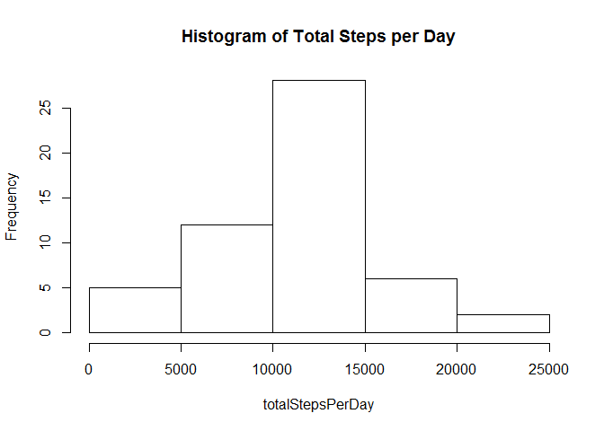

# Reproducible Research: Peer Assessment 1


## Loading and preprocessing the data

```r
if (!file.exists("activity.csv"))
    unzip("activity.zip")


activity <- read.csv(file = "activity.csv", header = TRUE, stringsAsFactors = FALSE, na.strings = "NA")
activity$date <- as.Date(activity$date)
```

## What is mean total number of steps taken per day?

```r
totalStepsPerDay <- tapply(activity$steps, activity$date, sum)
hist(totalStepsPerDay, main = "Histogram of Total Steps per Day")
```

<!-- -->
  
Mean and Median of totalStepsPerDay:

```r
summary(totalStepsPerDay)
```

```
##    Min. 1st Qu.  Median    Mean 3rd Qu.    Max.    NA's 
##      41    8841   10760   10770   13290   21190       8
```

Mean Steps per Individual Day:

```r
meanStepsPerDay <- tapply(activity$steps, activity$date, mean, na.rm = TRUE)
meanStepsPerDay
```

```
## 2012-10-01 2012-10-02 2012-10-03 2012-10-04 2012-10-05 2012-10-06 
##        NaN  0.4375000 39.4166667 42.0694444 46.1597222 53.5416667 
## 2012-10-07 2012-10-08 2012-10-09 2012-10-10 2012-10-11 2012-10-12 
## 38.2465278        NaN 44.4826389 34.3750000 35.7777778 60.3541667 
## 2012-10-13 2012-10-14 2012-10-15 2012-10-16 2012-10-17 2012-10-18 
## 43.1458333 52.4236111 35.2048611 52.3750000 46.7083333 34.9166667 
## 2012-10-19 2012-10-20 2012-10-21 2012-10-22 2012-10-23 2012-10-24 
## 41.0729167 36.0937500 30.6284722 46.7361111 30.9652778 29.0104167 
## 2012-10-25 2012-10-26 2012-10-27 2012-10-28 2012-10-29 2012-10-30 
##  8.6527778 23.5347222 35.1354167 39.7847222 17.4236111 34.0937500 
## 2012-10-31 2012-11-01 2012-11-02 2012-11-03 2012-11-04 2012-11-05 
## 53.5208333        NaN 36.8055556 36.7048611        NaN 36.2465278 
## 2012-11-06 2012-11-07 2012-11-08 2012-11-09 2012-11-10 2012-11-11 
## 28.9375000 44.7326389 11.1770833        NaN        NaN 43.7777778 
## 2012-11-12 2012-11-13 2012-11-14 2012-11-15 2012-11-16 2012-11-17 
## 37.3784722 25.4722222        NaN  0.1423611 18.8923611 49.7881944 
## 2012-11-18 2012-11-19 2012-11-20 2012-11-21 2012-11-22 2012-11-23 
## 52.4652778 30.6979167 15.5277778 44.3993056 70.9270833 73.5902778 
## 2012-11-24 2012-11-25 2012-11-26 2012-11-27 2012-11-28 2012-11-29 
## 50.2708333 41.0902778 38.7569444 47.3819444 35.3576389 24.4687500 
## 2012-11-30 
##        NaN
```
  
Median Steps per Individual Day:

```r
medianStepsPerDay <- tapply(activity$steps, activity$date, median, na.rm = TRUE)
medianStepsPerDay
```

```
## 2012-10-01 2012-10-02 2012-10-03 2012-10-04 2012-10-05 2012-10-06 
##         NA          0          0          0          0          0 
## 2012-10-07 2012-10-08 2012-10-09 2012-10-10 2012-10-11 2012-10-12 
##          0         NA          0          0          0          0 
## 2012-10-13 2012-10-14 2012-10-15 2012-10-16 2012-10-17 2012-10-18 
##          0          0          0          0          0          0 
## 2012-10-19 2012-10-20 2012-10-21 2012-10-22 2012-10-23 2012-10-24 
##          0          0          0          0          0          0 
## 2012-10-25 2012-10-26 2012-10-27 2012-10-28 2012-10-29 2012-10-30 
##          0          0          0          0          0          0 
## 2012-10-31 2012-11-01 2012-11-02 2012-11-03 2012-11-04 2012-11-05 
##          0         NA          0          0         NA          0 
## 2012-11-06 2012-11-07 2012-11-08 2012-11-09 2012-11-10 2012-11-11 
##          0          0          0         NA         NA          0 
## 2012-11-12 2012-11-13 2012-11-14 2012-11-15 2012-11-16 2012-11-17 
##          0          0         NA          0          0          0 
## 2012-11-18 2012-11-19 2012-11-20 2012-11-21 2012-11-22 2012-11-23 
##          0          0          0          0          0          0 
## 2012-11-24 2012-11-25 2012-11-26 2012-11-27 2012-11-28 2012-11-29 
##          0          0          0          0          0          0 
## 2012-11-30 
##         NA
```

## What is the average daily activity pattern?

```r
averageNumberOfStepsAcrossDays <- tapply(activity$steps, activity$interval, mean, na.rm = TRUE)
intervals <- unique(activity$interval)
plot(x = intervals, y = averageNumberOfStepsAcrossDays, type = "l")
```

<!-- -->

```r
intervalIndex <- which.max(averageNumberOfStepsAcrossDays)
intervalValue <- intervals[intervalIndex]
```

The 5-minute interval with the highest number of steps is: 835.  
This interval has 206.1698113 steps on average.  

## Imputing missing values


```r
numRowsWithNAs <- sum(is.na(activity$steps) | is.na(activity$date) | is.na(activity$interval))
```
Number of rows with NAs is: 2304.  
  
The strategy for filling in all of the missing values in the dataset. Using the mean for the equivalent 5-minute interval.

```r
newActivity <- activity

for (i in nrow(newActivity)) {
  if (is.na(newActivity$steps[i])) {  # Has missing value
    idx <- which(as.integer(row.names(averageNumberOfStepsAcrossDays)) == newActivity$interval[i])  # Find the mean for the same interval
    newActivity$steps[i] <- averageNumberOfStepsAcrossDays[idx] # Impute
  }
  
}

totalStepsPerDay2 <- tapply(newActivity$steps, newActivity$date, sum, na.rm = TRUE)
hist(totalStepsPerDay2, main = "Histogram of Total Steps per Day (with Imputation)")
```

<!-- -->
  
Mean and Median of totalStepsPerDay (with Imputation):

```r
summary(totalStepsPerDay2)
```

```
##    Min. 1st Qu.  Median    Mean 3rd Qu.    Max. 
##       0    6778   10400    9354   12810   21190
```

Mean Steps per Individual Day (with Imputation):

```r
meanStepsPerDay2 <- tapply(newActivity$steps, newActivity$date, mean, na.rm = TRUE)
meanStepsPerDay2
```

```
## 2012-10-01 2012-10-02 2012-10-03 2012-10-04 2012-10-05 2012-10-06 
##        NaN  0.4375000 39.4166667 42.0694444 46.1597222 53.5416667 
## 2012-10-07 2012-10-08 2012-10-09 2012-10-10 2012-10-11 2012-10-12 
## 38.2465278        NaN 44.4826389 34.3750000 35.7777778 60.3541667 
## 2012-10-13 2012-10-14 2012-10-15 2012-10-16 2012-10-17 2012-10-18 
## 43.1458333 52.4236111 35.2048611 52.3750000 46.7083333 34.9166667 
## 2012-10-19 2012-10-20 2012-10-21 2012-10-22 2012-10-23 2012-10-24 
## 41.0729167 36.0937500 30.6284722 46.7361111 30.9652778 29.0104167 
## 2012-10-25 2012-10-26 2012-10-27 2012-10-28 2012-10-29 2012-10-30 
##  8.6527778 23.5347222 35.1354167 39.7847222 17.4236111 34.0937500 
## 2012-10-31 2012-11-01 2012-11-02 2012-11-03 2012-11-04 2012-11-05 
## 53.5208333        NaN 36.8055556 36.7048611        NaN 36.2465278 
## 2012-11-06 2012-11-07 2012-11-08 2012-11-09 2012-11-10 2012-11-11 
## 28.9375000 44.7326389 11.1770833        NaN        NaN 43.7777778 
## 2012-11-12 2012-11-13 2012-11-14 2012-11-15 2012-11-16 2012-11-17 
## 37.3784722 25.4722222        NaN  0.1423611 18.8923611 49.7881944 
## 2012-11-18 2012-11-19 2012-11-20 2012-11-21 2012-11-22 2012-11-23 
## 52.4652778 30.6979167 15.5277778 44.3993056 70.9270833 73.5902778 
## 2012-11-24 2012-11-25 2012-11-26 2012-11-27 2012-11-28 2012-11-29 
## 50.2708333 41.0902778 38.7569444 47.3819444 35.3576389 24.4687500 
## 2012-11-30 
##  1.0754717
```
  
Median Steps per Individual Day (with Imputation):

```r
medianStepsPerDay2 <- tapply(newActivity$steps, newActivity$date, median, na.rm = TRUE)
medianStepsPerDay2
```

```
## 2012-10-01 2012-10-02 2012-10-03 2012-10-04 2012-10-05 2012-10-06 
##         NA   0.000000   0.000000   0.000000   0.000000   0.000000 
## 2012-10-07 2012-10-08 2012-10-09 2012-10-10 2012-10-11 2012-10-12 
##   0.000000         NA   0.000000   0.000000   0.000000   0.000000 
## 2012-10-13 2012-10-14 2012-10-15 2012-10-16 2012-10-17 2012-10-18 
##   0.000000   0.000000   0.000000   0.000000   0.000000   0.000000 
## 2012-10-19 2012-10-20 2012-10-21 2012-10-22 2012-10-23 2012-10-24 
##   0.000000   0.000000   0.000000   0.000000   0.000000   0.000000 
## 2012-10-25 2012-10-26 2012-10-27 2012-10-28 2012-10-29 2012-10-30 
##   0.000000   0.000000   0.000000   0.000000   0.000000   0.000000 
## 2012-10-31 2012-11-01 2012-11-02 2012-11-03 2012-11-04 2012-11-05 
##   0.000000         NA   0.000000   0.000000         NA   0.000000 
## 2012-11-06 2012-11-07 2012-11-08 2012-11-09 2012-11-10 2012-11-11 
##   0.000000   0.000000   0.000000         NA         NA   0.000000 
## 2012-11-12 2012-11-13 2012-11-14 2012-11-15 2012-11-16 2012-11-17 
##   0.000000   0.000000         NA   0.000000   0.000000   0.000000 
## 2012-11-18 2012-11-19 2012-11-20 2012-11-21 2012-11-22 2012-11-23 
##   0.000000   0.000000   0.000000   0.000000   0.000000   0.000000 
## 2012-11-24 2012-11-25 2012-11-26 2012-11-27 2012-11-28 2012-11-29 
##   0.000000   0.000000   0.000000   0.000000   0.000000   0.000000 
## 2012-11-30 
##   1.075472
```


Do these values differ from the estimates from the first part of the assignment?  
Means Differ? 'is.NA' value mismatch: 7 in current 8 in target  
Medians Differ? 'is.NA' value mismatch: 7 in current 8 in target  

Impact?  
It makes the estimates of total steps per day greater or equal to without imputing NA 
In addition the means and medians in the for sets with imputation has less number of NAs  

## Are there differences in activity patterns between weekdays and weekends?


```r
newActivity$weekend <- weekdays(newActivity$date) == "Saturday" | weekdays(newActivity$date) == "Sunday"
newActivity$weekend <- factor(newActivity$weekend, levels = c(FALSE, TRUE), labels = c("weekday", "weekend"))

newActivitySplit <- split(newActivity, newActivity$weekend)

weekdaysAverages <- tapply(newActivitySplit$weekday$steps, newActivitySplit$weekday$interval, mean, na.rm = T)
weekdaysAveragesDS <- data.frame(interval = as.integer(row.names(weekdaysAverages)),
                               steps = weekdaysAverages,
                               weekend = F)

weekendAverages <- tapply(newActivitySplit$weekend$steps, newActivitySplit$weekend$interval, mean, na.rm = T)
weekendAveragesDS <- data.frame(interval = as.integer(row.names(weekendAverages)),
                               steps = weekendAverages,
                               weekend = T)

# recombine averages into a single dataset
fullWeekAverages <- rbind(weekdaysAveragesDS, weekendAveragesDS)
fullWeekAverages$weekend <- factor(fullWeekAverages$weekend, levels = c(FALSE, TRUE), labels = c("weekday", "weekend"))

attach(fullWeekAverages)
xyplot(steps ~ interval | weekend, type = "l", layout=c(1, 2))
```

<!-- -->

From the above chart we can easily notice that there are differences between the average steps during weekdays and weekends
